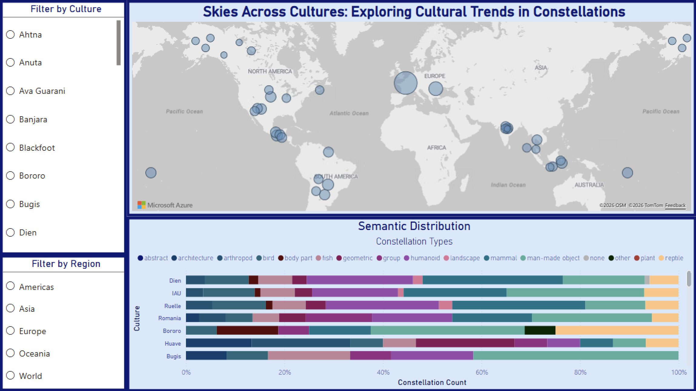
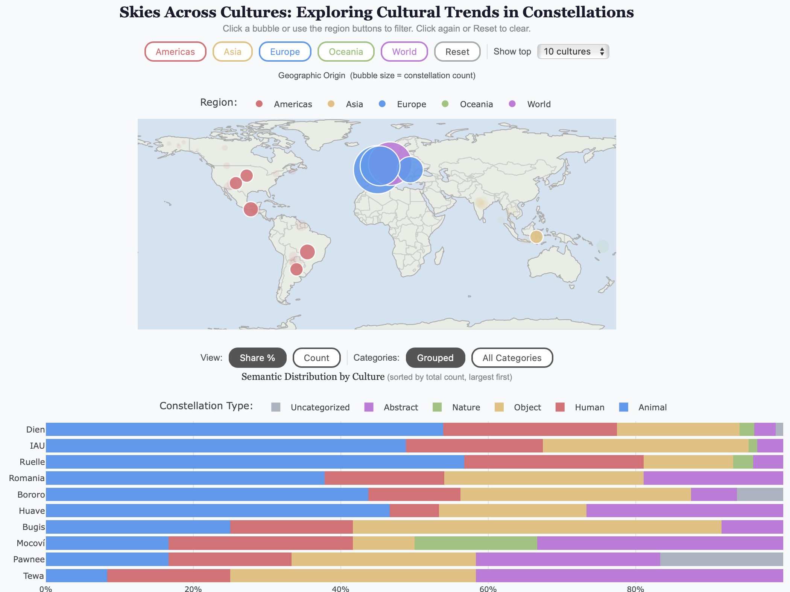
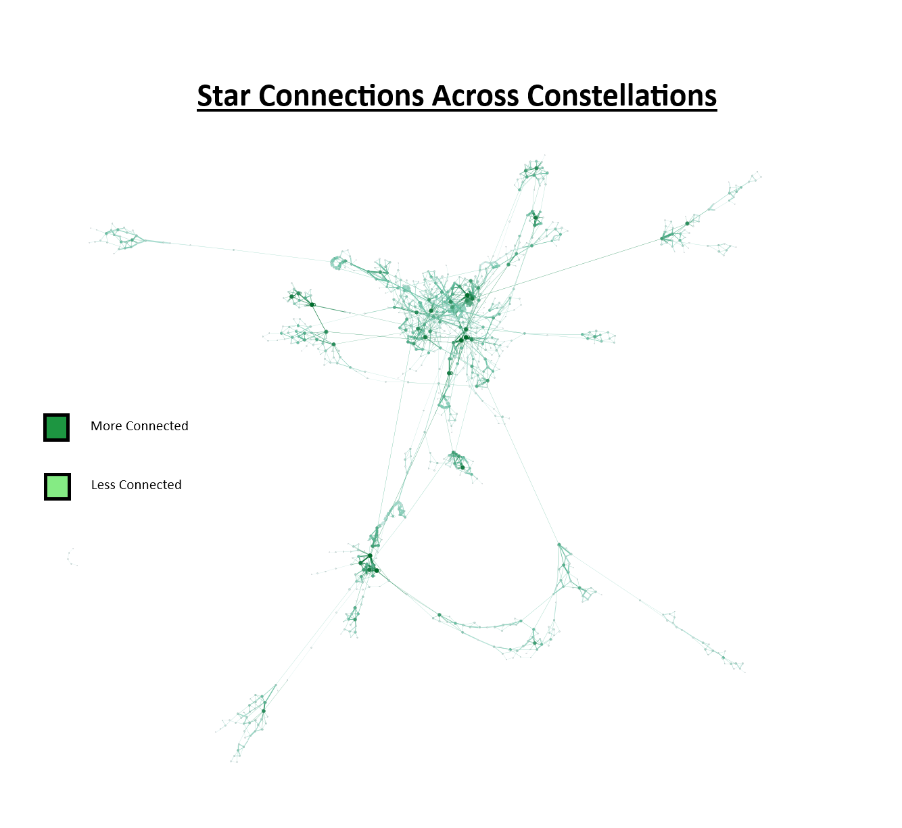
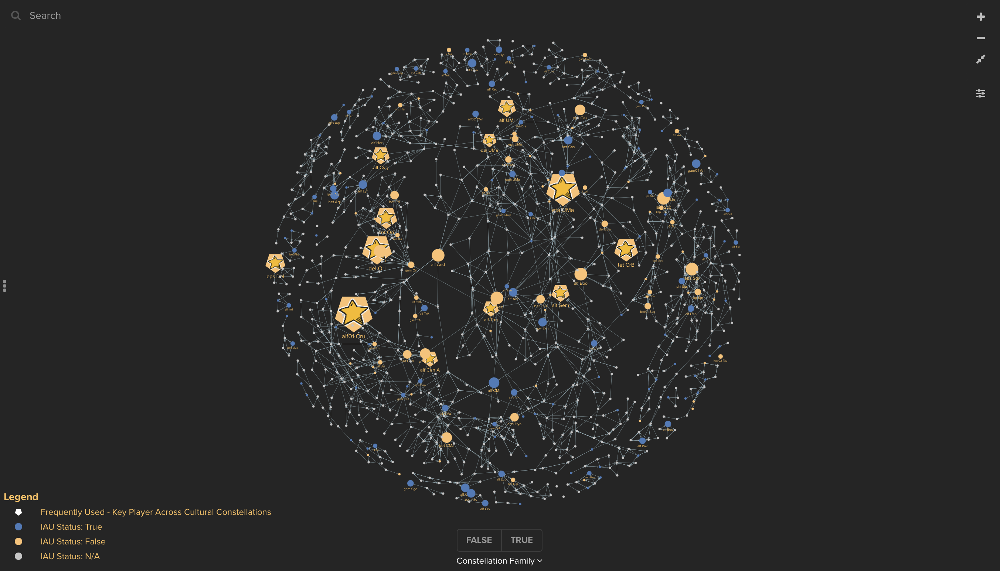

# SkiesAcrossCultures
This is for a Client project as a part of the Information Visualization Class (ENGR-E483).

## Geospatial Visualization (Power BI)

  
  This geospatial visualization (Figure 1) is important because it categorizes constellation types and their associated geospatial aspects. This allows users to observe trends across cultures and regions and to inspect the semantic distributions across and within these variables. The map allows a user to see the number of constellations in a given area/culture, while the bar chart provides a semantic breakdown of selected culture(s). This allows for a user to see geographic and semantic trends and how they may interact with each other. The tooltips on the map allow for a broad overview of the associated culture and its location information, as provided through the client's cleaned dataset.

Project Linked [here](https://app.powerbi.com/view?r=eyJrIjoiMWQxMDFiNzItMjA3Zi00OGM0LTljYTMtYmE1MzNjZGY1YTQ5IiwidCI6IjExMTNiZTM0LWFlZDEtNGQwMC1hYjRiLWNkZDAyNTEwYmU5MSIsImMiOjN9)

## Geospatial Visualization (.html)

  This is an improved implementation of Figure 1. This adds more visual and functional features in order to be more appealing and engaging.

## Network Visualization (Gephi)

  
  This network visualization (Figure 2) is important because it shows an overview of the interconnectedness of stars. This allows for exploration of commonly used stars and large constellation networks. The network allows for a user to be quickly drawn to dark/dense areas, which represent stars that play a heavy role in constellations across time, location, and cultures.

## Network Visualization (Kumu)

This visualization was done by using Kumu instead of Gephi. By adding interactive legends and constellation family insights, this is an improvement of the initial network visualization.

Project Linked [here](https://embed.kumu.io/84c89a723710f4ee478f8678c2578ba3)
